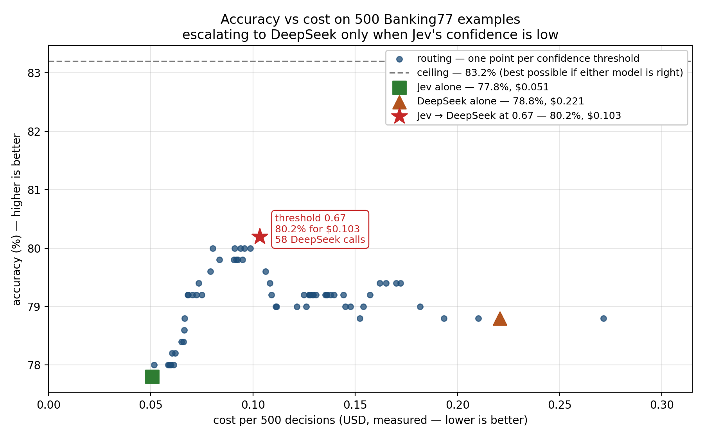
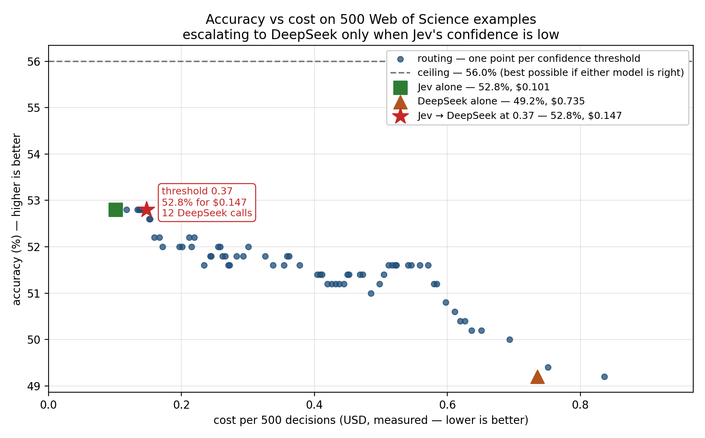
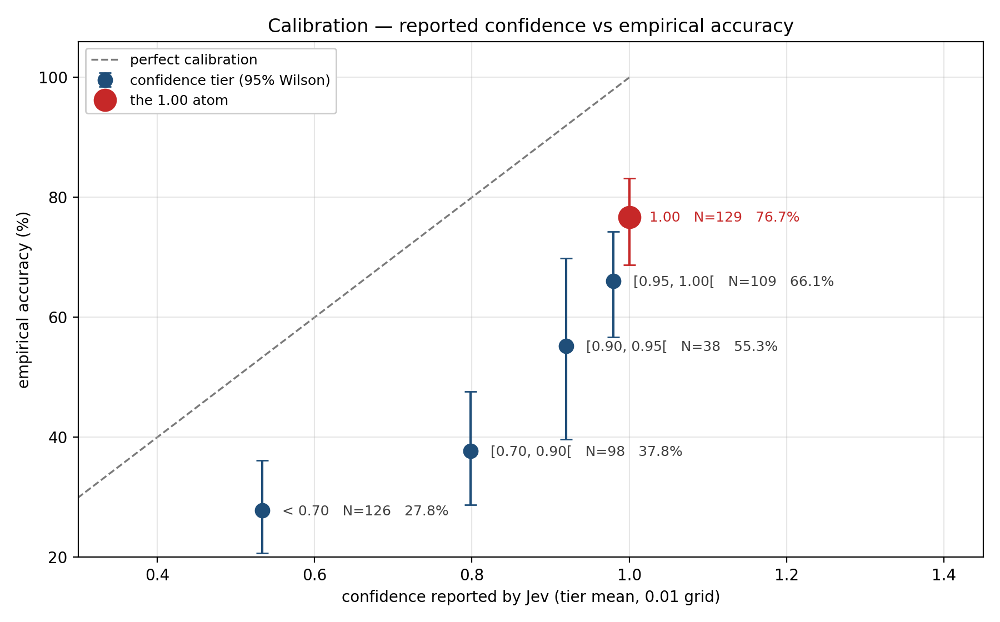
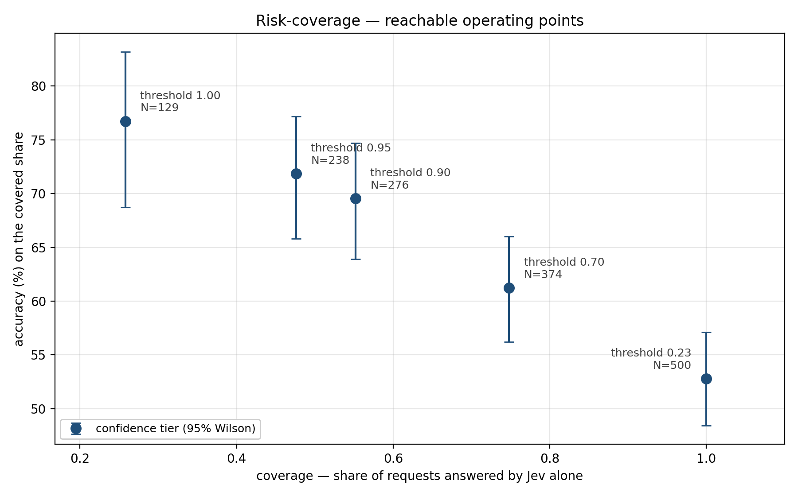
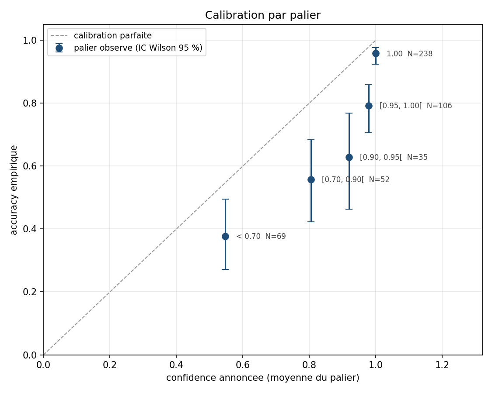

# calibre

> **Jev says it's 100% sure. Is it?** On 500 Banking77 examples it is right 95.8% of
> the time. On 500 Web of Science abstracts, 76.7%.
>
> Routing on that signal reaches **80.2% at $0.1033 per 500 decisions** on Banking77,
> against 78.8% at $0.2207 for DeepSeek V4-Pro alone. On Web of Science the same
> routing **ties Jev alone — 52.8% either way — for 46% more money**.
>
> **Two datasets, opposite outcomes. Nothing measured on the first carried over to
> the second.**



## TL;DR

**Banking77** — 500 examples, 77 intent classes:

- **Jev alone:** 77.8% accuracy at $0.0507 / 500 decisions.
- **DeepSeek alone:** 78.8% accuracy at $0.2207 / 500 decisions.
- **Jev → DeepSeek at 0.67:** 80.2% accuracy at $0.1033 / 500 decisions, with DeepSeek called on 11.6% of requests.

**Web of Science** — 500 abstracts, 145 subject classes:

- **Jev alone:** 52.8% accuracy at $0.1006 / 500 decisions.
- **DeepSeek alone:** 49.2% accuracy at $0.7355 / 500 decisions.
- **Jev → DeepSeek at 0.37:** 52.8% accuracy at $0.1474 / 500 decisions, with DeepSeek called on 2.4% of requests — the same accuracy as Jev alone, for more money.

[Jump to the second dataset](#second-dataset-web-of-science) · [what transfers between them](#what-transfers-between-the-two-datasets)

This repository measures the calibration of [TypeSafe](https://docs.typesafe.ai/)'s
Jev decision model and evaluates **confidence-based routing**: a Jev → fallback
cascade that escalates only what Jev is unsure about. It answers one question:
**at what confidence level can Jev decide on its own, rather than paying a larger
model, for a given accuracy target?**

The protocol was frozen before any result was looked at
([commit `2384a6b`](../../commit/2384a6b)). The dataset, the raw results and the
analysis code are all in this repository.

## Results — Banking77

500 examples from the Banking77 test split, 77 intent labels, one call per example.

| Strategy | Accuracy | Cost / 500 | DeepSeek calls |
|---|---|---|---|
| Jev only | 77.8% | $0.0507 | 0 |
| DeepSeek V4-Pro only | 78.8% | $0.2207 | 500 |
| **Cascade @ 0.67** | **80.2%** | **$0.1033** | **58** (11.6%) |
| Oracle | 83.2% | — | — |

**What this means:** On this dataset, confidence-based routing improves accuracy over
either model alone while reducing DeepSeek usage; the disagreements where DeepSeek is
correct are concentrated at lower Jev confidence levels.

The cascade keeps Jev's answer when its confidence reaches the threshold and
escalates otherwise. Its cost always includes Jev on all 500 requests — the
confidence has to be obtained before anything can be routed on it — plus DeepSeek
on the escalated fraction. Both figures are measured per row, not estimated from
a list price: the DeepSeek side accounts for the cache hit/miss split and the
hourly rate in force at the time of each call.

The oracle counts an example as correct when either model got it right. It is the
ceiling of this cascade, not of the task.

## Second dataset: Web of Science

Same pipeline, same metrics, same guard rails, same pre-registered targets. Only the
dataset changes: 500 abstracts from the WOS-46985 corpus, 145 subject classes across
7 parent domains, against Banking77's 77 intent classes.



| Strategy | Accuracy | Cost / 500 | DeepSeek calls |
|---|---|---|---|
| Jev only | 52.8% | $0.1006 | 0 |
| DeepSeek V4-Pro only | 49.2% | $0.7355 | 500 |
| Cascade @ 0.37 | 52.8% | $0.1474 | 12 (2.4%) |
| Oracle | 56.0% | — | — |

**The cascade loses on this dataset.** It reaches 52.8%, which is exactly what Jev
alone reaches, and it costs $0.1474 against $0.1006 — **46% more for the same
accuracy**. This is not a neutral outcome: paying more for no gain is a worse
operating point than not routing at all. On Banking77 the same rule gained 1.4 points
for roughly half the cost of the fallback. **Without measuring on your own data, you
cannot tell which of the two situations you are in.**

The threshold was not chosen by hand on either dataset. It falls out of the sweep over
every observed confidence level, and 0.37 is simply where accuracy peaks here.

### Pre-registered targets

| Target | Status | Best threshold reached |
|---|---|---|
| 90% | **unattainable** | 0.37 → 52.8% (−37.2 points) |
| 95% | **unattainable** | 0.37 → 52.8% (−42.2 points) |
| 98% | **unattainable** | 0.37 → 52.8% (−45.2 points) |

The targets were fixed before any frontier run and are not revised. On Banking77 they
were already out of reach because the fallback itself reached only 78.8%; here the
fallback reaches 49.2%.

### Calibration



Every tier again sits below the diagonal. The saturated level holds **25.8% of the
traffic at 76.7% accuracy**, where on Banking77 it held 47.6% at 95.8%.



Over the 371 rows outside the saturated level, the paired bootstrap separates none of
the four statistics — all three differences against `confidence` span zero, where on
Banking77 two of them excluded it.

| Statistic | AUROC | Difference vs `confidence` (95% CI) |
|---|---|---|
| `confidence` | 0.690 | — |
| `entropy_norm` | 0.697 | −0.008 [−0.023, +0.006] |
| `margin_top2` | 0.681 | +0.009 [−0.000, +0.018] |
| `ratio_top2` | 0.677 | +0.013 [−0.001, +0.025] |

### Ground truth on this dataset is weaker, and it matters here

**This reservation carries as much weight as the result above.** The WOS categories
come from publication metadata, not from an annotator who read each abstract, and the
taxonomy is hierarchical, so many classes are near-synonyms inside one parent domain.

Of the 220 errors both models make, **57.3% stay inside the gold's own parent domain**.
The most frequent shared (gold → prediction) pairs are defensible answers rather than
plain mistakes:

```
6  biochemistry/Southern blotting   → biochemistry/Molecular biology
4  biochemistry/Northern blotting   → biochemistry/Molecular biology
4  ECE/Electric motor               → ECE/Control engineering
3  Medical/Polycythemia Vera        → Medical/Cancer
2  Psychology/Person perception     → Psychology/Social cognition
```

Southern blotting *is* molecular biology; polycythemia vera *is* a blood cancer. **The
52.8% accuracy and the 56.0% oracle may reflect the weakness of the labels as much as
the difficulty of the task**, and this repository does not separate the two. The
Banking77 numbers carry the same caveat in milder form, and `data/README.md` states
both in full.

### Cost of the run

$0.8361 in total — **$0.7355 for DeepSeek and $0.1006 for Jev**. The cache hit rate
fell to 92.1% from Banking77's 97.9%, since the variable part of the prompt grew from
a few words to a full abstract; billing the input without separating cache hits from
misses would have read $1.9964 instead.

## What transfers between the two datasets

Nothing measured on Banking77 predicted Web of Science.

| | Banking77 | Web of Science |
|---|---|---|
| classes | 77 | 145 |
| accuracy, Jev | 77.8% | 52.8% |
| accuracy, DeepSeek | 78.8% | 49.2% |
| **gap, Jev − DeepSeek** | **−1.0 pt** (frontier ahead) | **+3.6 pt** (Jev ahead) |
| oracle | 83.2% | 56.0% |
| share of traffic at the 1.00 level | 47.6% | 25.8% |
| accuracy at the 1.00 level | 95.8% | 76.7% |
| **optimal threshold** | **0.67** | **0.37** |
| accuracy at that threshold | 80.2% | 52.8% |
| escalated at that threshold | 11.6% | 2.4% |
| cost at that threshold | $0.1033 | $0.1474 |
| best single model | 78.8% | 52.8% |
| **cascade beats it?** | **yes, +1.4 pt** | **no, +0.0 pt** |
| derived statistics vs `confidence` | two intervals excluded zero | all three span zero |

The sign of the accuracy gap between the two models reverses. The optimal threshold
moves from 0.67 to 0.37. The saturated confidence level halves in size and loses 19
points of accuracy. The cascade goes from beating the better single model to matching
it at higher cost. None of these were predictable from the first dataset.

METHOD.md recorded, before any of this was run, that a threshold far from 0.67 would
be a result rather than a failure, and that a negative result publishes as a positive
one does.

## Calibration — Banking77

`confidence` is not a probability of being right. It is a statistic derived from
the shape of the probability distribution, and measuring what it actually predicts
is the point of this repository.

**On these 500 examples, every tier sits below the diagonal: reported confidence runs
ahead of measured accuracy at every level, the 1.00 atom included.** That is an
observation about this dataset and this model version, not a property established for
other tasks.

**The scale is discrete.** Measured on the raw HTTP body, before any SDK parsing:
across 1,540 probability values, none falls off a 0.01 grid, and `confidence` has
the same granularity as `probabilities`. Nothing is representable between 0.99 and
1.00. On the full run, 44 values out of 38,500 sit up to one double ULP off the
grid, which is float arithmetic, not extra resolution.



**Accuracy per observed confidence level** (63 distinct levels; the four largest):

| Confidence | N | Correct | Accuracy | 95% Wilson |
|---|---|---|---|---|
| 1.00 | 238 | 228 | 95.8% | [92.4%, 97.7%] |
| 0.99 | 46 | 37 | 80.4% | [66.8%, 89.3%] |
| 0.98 | 24 | 19 | 79.2% | [59.5%, 90.8%] |
| 0.97 | 18 | 14 | 77.8% | [54.8%, 91.0%] |

The 1.00 level carries 47.6% of the traffic at 95.8% accuracy. Accuracy drops to
80.4% at the very next representable level. 58 of the 63 levels hold fewer than 10
observations each, together 32.4% of the mass, so no single row below the top few
supports a conclusion on its own.

**No tested derived statistic improves on `confidence`.** Three alternatives computed from
the raw distribution — `margin_top2`, `entropy_norm`, `ratio_top2` — were compared
by AUROC over the 262 rows outside the 1.00 level, which is the only region where
they are not constant by construction. Paired bootstrap, 10,000 iterations,
seed 1729:

| Statistic | AUROC | Difference vs `confidence` (95% CI) |
|---|---|---|
| `confidence` | 0.706 | — |
| `entropy_norm` | 0.705 | +0.002 [−0.012, +0.015] |
| `margin_top2` | 0.695 | +0.011 [+0.001, +0.021] |
| `ratio_top2` | 0.691 | +0.015 [+0.003, +0.028] |

The data show no improvement of the alternative statistics over `confidence`. The
bootstrap intervals exclude zero for the `margin_top2` and `ratio_top2` differences,
but the observed differences are small. The alternatives were not pre-registered with
a minimum margin to beat, so this is an absence of improvement, not a reversal.

## Agreement between the two models — Banking77

| | Count | Share |
|---|---|---|
| Both correct | 367 | 73.4% |
| Both wrong, same prediction | 75 | 15.0% |
| Both wrong, different predictions | 9 | 1.8% |
| Jev correct, DeepSeek wrong | 22 | 4.4% |
| DeepSeek correct, Jev wrong | 27 | 5.4% |

Among the 49 disagreements, 74.1% of those DeepSeek wins fall below confidence 0.70,
against 59.1% of those Jev wins. That concentration is what the routing rule exploits:
DeepSeek-correct disagreements are disproportionately concentrated in the
low-confidence tail.

On the 238 examples where Jev returned confidence = 1.00, DeepSeek produced the
identical prediction in 238 out of 238 cases.

## Limitations

**Two datasets, 500 examples each, both in English.** Banking77 intent
classification and Web of Science subject classification. Nothing here establishes
behaviour on other tasks, other languages or other label sets. Two datasets show
that the parameters do not transfer between *these two*; they do not establish how
they behave on a third.

**Neither threshold is a constant of the mechanism.** 0.67 is where accuracy peaks
on Banking77, 0.37 on Web of Science. Both are observations about their own 500
examples. A threshold must be re-derived on any new workload, never copied from
here.

**Whether routing pays is itself dataset-dependent.** It gained 1.4 points for
about half the cost of the fallback on Banking77, and gained nothing for 46% more
than Jev alone on Web of Science. Both outcomes came out of the identical
pipeline.

**The pre-registered targets are unreachable on both datasets.** 90%, 95% and 98%
were fixed before any frontier run. DeepSeek V4-Pro alone reaches 78.8% on
Banking77 and 49.2% on Web of Science, so all three were beyond the fallback
itself, whatever the routing rule. That is a design fault in the protocol
— the targets were set with no known upper bound — and it is reported rather than
corrected. The targets are not revised.

**The oracle belongs to this pair of models, not to the dataset.** On 84 of the 500
Banking77 examples and 220 of the 500 Web of Science abstracts, neither model has
the right answer, capping the cascade at 83.2% and 56.0% respectively. A different
fallback could recover some of those; the ceilings would move.

**Common errors fall mostly between semantically adjacent classes on both
datasets.** On Banking77, 47 distinct (gold, prediction) pairs across 84 errors:
`order_physical_card` to `get_physical_card`, `card_delivery_estimate` to
`card_arrival`. On Web of Science, 57.3% of the 220 shared errors stay inside the
parent domain of the gold label, with pairs like `Southern blotting` to
`Molecular biology` that are defensible answers. **How much of this is label
ambiguity rather than model error has not been established on either dataset**, and
this repository does not attempt to. It weighs heavier on Web of Science, whose
labels come from publication metadata rather than per-document annotation.

**The frontier baseline is DeepSeek V4-Pro.** Claude Opus 5 is announced for v2; the
provider interface is in place and the protocol is frozen, so it is a run to launch,
not a rewrite. An attempt on Gemini 3.8 Flash was abandoned — its free tier allows 20
requests a day, which would make 500 examples take 25 days — and its partial data is
excluded.

**No reproducibility claim for the frontier side.** `temperature` has been removed
from the API generation used by the Anthropic backend and returns a 400; DeepSeek and
Gemini both return an alias rather than a resolved version, unlike Jev's
`jev-1.13.0`. Two runs of the same file may differ.

## Reproduction

Total cost of a full reproduction: **~$1.11** — $0.2714 for Banking77 ($0.0507 Jev,
$0.2207 DeepSeek) and $0.8361 for Web of Science ($0.1006 Jev, $0.7355 DeepSeek).

```bash
pip install typesafe-sdk openai numpy matplotlib

cat > .env <<'EOF'
TYPESAFE_API_KEY=...
DEEPSEEK_API_KEY=...
EOF

python src/probe.py            # one call, prints the raw response

# Banking77
python src/prepare_data.py                                       # rebuilds the dataset
python src/run_jev.py      --task banking77                      # 500 calls, ~$0.051
python src/run_frontier.py --task banking77 --provider deepseek  # 500 calls, ~$0.221
python src/analyze.py      --task banking77
python src/cascade.py      --task banking77

# Web of Science
python src/prepare_data_wos.py                                   # downloads ~60 MB
python src/run_jev.py      --task wos                            # 500 calls, ~$0.101
python src/run_frontier.py --task wos --provider deepseek        # 500 calls, ~$0.736
python src/analyze.py      --task wos
python src/cascade.py      --task wos
```

The runners take `--task`; no dataset is hard-coded in them.

Both runners write one line at a time, resume on the ids already present, and refuse
to resume when an existing line carries a different `prompt_hash` — two prompt
versions can never share a file.

Both datasets are committed with their hashes, so a re-download that drifts is
detectable:

```
sha256(banking77 test.csv)    d12d6e3bc4c3103966ae786dc435913c0c563dfa328f5a3646d0e62cfeeb474d
sha256(banking77_500.jsonl)   33547bc2c3453057fbeb50cc5cb68da32c6da3c1b79b5deae47567c20fcf0bb6
sha256(WOS archive)           b787d484bff88b0dcdb3fa291d06ec9d2f025dc2a67ce1045d0c688cd96ccf8a
sha256(wos_500.jsonl)         23954a60f8ac255bdff021f006aa625b9d8742723d8afe5d53110ebe74fc131c
```

`analyze.py` and `cascade.py` never call an API. They read `results/raw/` and compute.

## Layout

```
src/probe.py             one call, prints the raw unparsed response
src/tasks.py             task registry: name -> labels module + data file
src/labels.py            Banking77, 77 labels, id -> name -> description
src/labels_wos.py        Web of Science, 145 classes, plus each parent domain
src/prepare_data.py      builds the frozen Banking77 dataset
src/prepare_data_wos.py  builds the frozen Web of Science dataset
src/run_jev.py           Jev on a task's 500 -> JSONL
src/providers.py         frontier backends behind one interface
src/run_frontier.py      a frontier backend on a task's 500 -> JSONL
src/analyze.py           calibration, risk-coverage, figures
src/cascade.py           cascade simulation, zero API calls
data/                    frozen datasets + provenance
results/raw/             raw JSONL, one line per example
results/figures/         figures, regenerated by analyze.py and cascade.py
docs/METHOD.md           protocol, measured constraints, related work
```

Both figures are produced from the committed raw results by the scripts above. None
is redrawn by hand.

## Related work

Verified on 2026-09-17 against the repositories themselves. This rests on a name
search on GitHub, so it is not exhaustive, and no claim of the form "nobody has done
X" is drawn from it.

Several open-source reimplementations of the decision pattern appeared after Jev
shipped on 2026-09-15. They differ in whether they expose calibration at all, and
whether they publish measurements against real ground truth — the two come apart in
practice.

- [genai-craft/openvons](https://github.com/genai-craft/openvons) carries the fullest
  calibration surface: temperature, isotonic, and ECE / Brier / NLL / macro-F1.
- [bnsd55/openjev](https://github.com/bnsd55/openjev) reports a fitted temperature and
  ECE before and after (0.0870 → 0.0773 at T = 1.7178) on 72 field-level decisions.
- [TheoLeeCJ/openjev](https://github.com/TheoLeeCJ/openjev) publishes balanced accuracy
  on WANLI (256 rows) and on an authored set (144 rows), without calibration metrics.
- [kw2828/OpenJev](https://github.com/kw2828/OpenJev) states outright that its scores
  are uncalibrated, and works on synthetic data.
- [aigodsend9-boop/specter-decision-engine](https://github.com/aigodsend9-boop/specter-decision-engine)
  is a framework with no trained model bundled, exposing temperature via NLL, isotonic
  via PAV, and Brier / NLL / ECE with bootstrap.
- [grishahq/decisionbridge](https://github.com/grishahq/decisionbridge) adapts existing
  LLMs into decision functions with temperature calibration; its bundled evaluation is
  described by its own README as a small, English-only, AI-authored synthetic pilot.
- [dbobo4/local-llm-probabilistic-decision-engine](https://github.com/dbobo4/local-llm-probabilistic-decision-engine)
  scores candidates directly and warns that calibration must be measured separately on
  representative labelled data.
- [hamakyo/jev-starter](https://github.com/hamakyo/jev-starter) targets the closest
  programme to this one — decision contracts, thresholds, fallbacks, and a Jev →
  fallback cascade on a labelled dataset. Its
  [issue #5](https://github.com/hamakyo/jev-starter/issues/5) specifies ECE, Brier,
  threshold sweeps and coverage-versus-risk. At the time of checking those metrics are
  presented as planned rather than published.

Agent-side integrations exist as well, including
[browser-use/jev-ultrafast](https://github.com/browser-use/jev-ultrafast), which
publishes task-timing measurements and notes itself that they are not a general
reliability benchmark.

TypeSafe publishes its own workflow evals, whose method is set out under
[*How we evaluate* → *Assume the harness is correct*](https://evals.typesafe.ai/).
Their reference labels are, in their words, "generated via an average of the responses of
GPT-6 Astra and Claude Fable 5.1, both at high thinking", and they state that they
"assume that the code is correct, and measure against the current smartest large
models" rather than optimising for a ground-truth classification.
**TypeSafe's reference methodology evaluates agreement with its reference models,
whereas calibre evaluates predictions against human-labelled ground truth.** These
answer different questions and neither substitutes for the other.

Jev is also available on [Vercel's AI Gateway](https://vercel.com/changelog/typesafe-ai-jev-now-available-on-ai-gateway)
as `typesafe-ai/jev`, announced on 16 September 2026, the day after Jev shipped.

Our contribution is an empirical evaluation of confidence-based selective automation
on a real ground-truth dataset, rather than another implementation of the decision
layer itself.

Full survey, with what was and was not verified: [`docs/METHOD.md`](docs/METHOD.md).

## License

MIT — see [LICENSE](LICENSE).

Banking77 is distributed under CC BY 4.0; see [`data/README.md`](data/README.md) for
provenance and citation.
